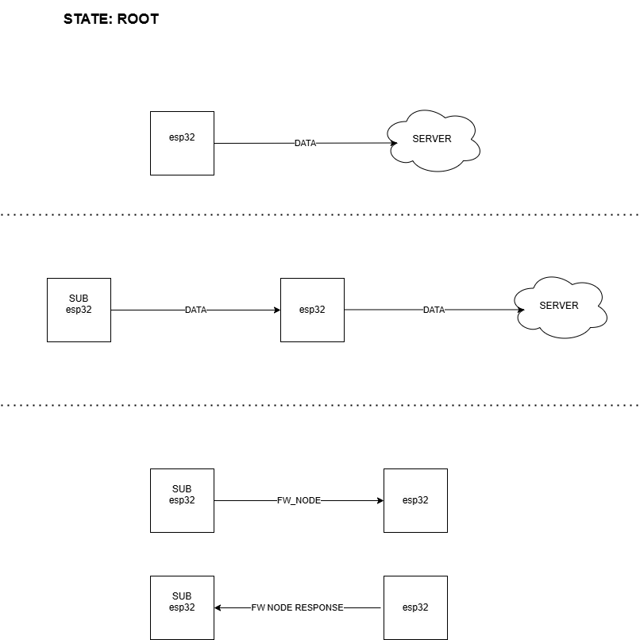
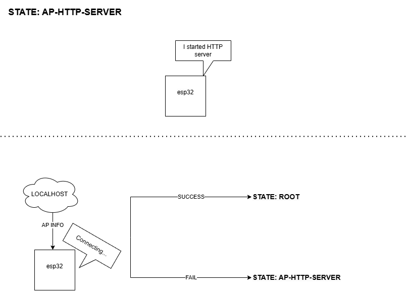
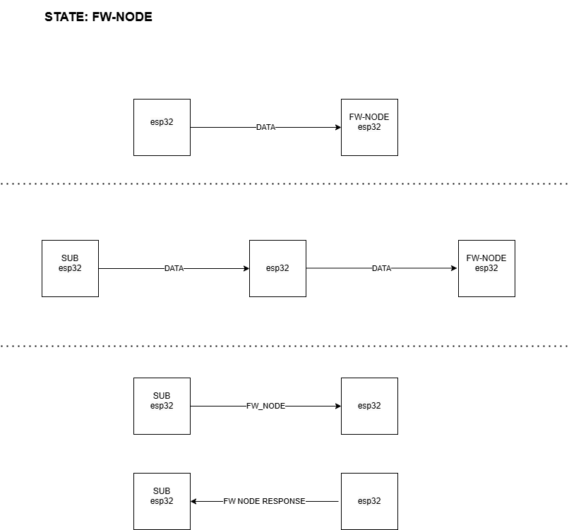
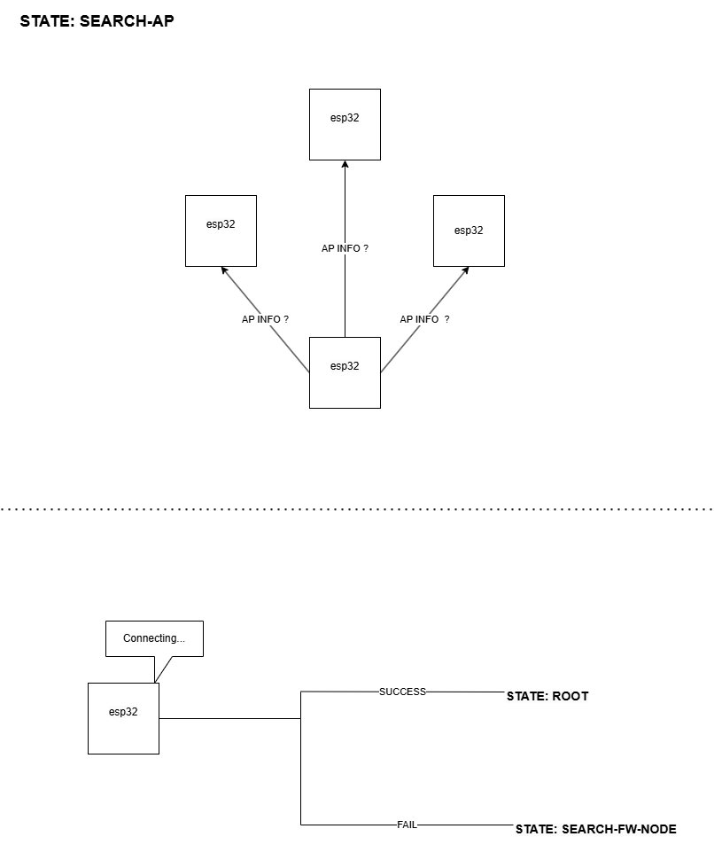
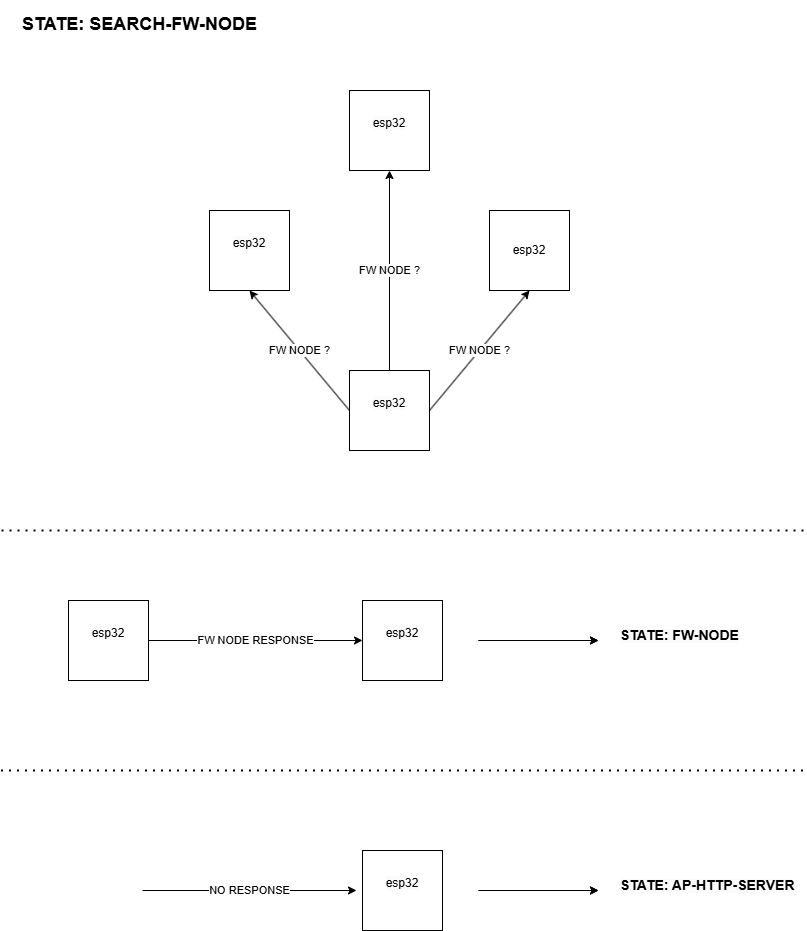

# ESP32 Swarm IoT Network

## Descriere
Acest proiect își propune să dezvolte o rețea IoT scalabilă și sigură, capabilă să integreze senzori și actuatori pentru colectarea, procesarea și vizualizarea datelor de mediu. Soluția oferă monitorizare în timp real, control la distanță și interoperabilitate cu alte sisteme IoT.

## Caracteristici principale
- **Integrarea senzorilor și actuatorilor:** Colectare de date și automatizare.
- **Comunicare sigură:** Utilizare ESP-NOW pentru comunicații locale și HTTP/TLS pentru transferuri externe.
- **Interfață Web:** Vizualizare și configurare intuitivă a datelor.
- **Securitate:** Protecție a datelor prin criptare TLS.

## Arhitectură
Proiectul folosește o combinație de protocoale pentru o comunicare eficientă:
- **ESP-NOW:** Rapid, peer-to-peer, între nodurile ESP32.
- **HTTP:** Pentru conexiuni către servere cloud externe.
- **Wi-Fi:** Conectivitate și acces la interfața web.

### Componente
1. **Senzori IoT:** Măsoară parametrii precum temperatura și umiditatea.
2. **Hub Central (ESP32):** Funcționează ca root sau forwarding node și gestionează datele.
3. **Interfață Web:** Permite vizualizarea datelor și configurarea rețelei.
4. **Serviciu Cloud:** Stocare și procesare avansată.

### Diagramă arhitectură rețea

### Noduri în rețea
- **AP-HTTP Server:**  
  

- **Forwarding Node:**  
  

- **Search Node pentru AP:**  
  

- **Search Node pentru FW:**  
  

## Vizualizarea și procesarea datelor
Datele colectate sunt disponibile prin:
1. **Pagina principală a aplicației web.**
2. **Pagini dedicate fiecărui nod ESP, cu grafice detaliate.**
3. **Notificări prin e-mail în cazul alertelor.**

## Securitate
Proiectul utilizează criptare TLS, asigurând confidențialitatea și integritatea datelor transmise.